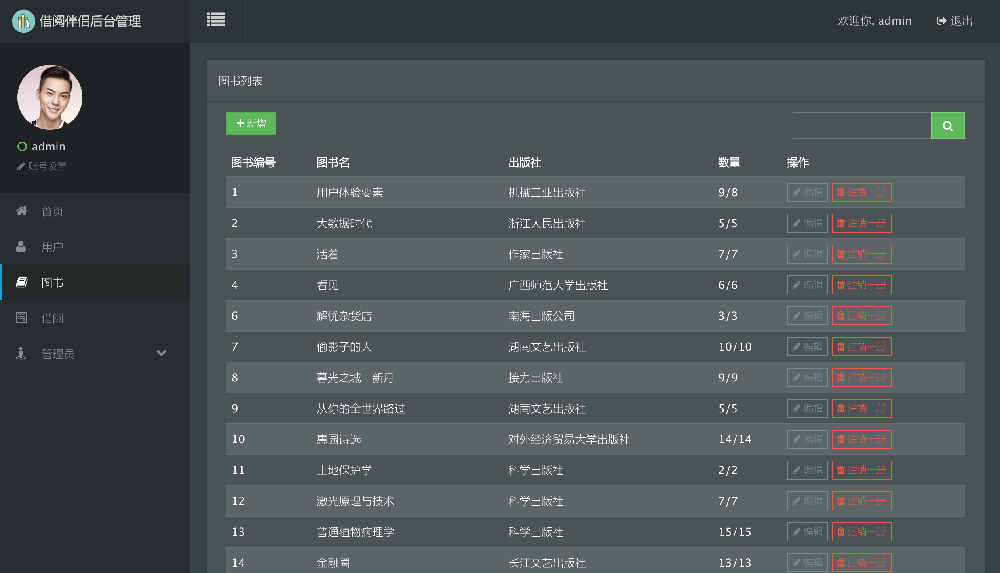

"无微不至"的借阅伴侣 
======================

项目介绍
----------------------

一款用于图书推荐、搜索、借阅、交流的微信小程序

使用技术
----------------------

**前端**

+ 微信小程序

+ UI框架: Amaze UI

+ 数据可视化处理库: Highcharts.js

**后端**

+ Web MVC框架: Spring MVC

+ ORM框架: MyBatis

+ IOC与AOP框架: Spring

**算法**

+ 算法服务器Web框架: Django

+ 使用算法: 
	> * 模糊C均值聚类(FCM)
	> * 基于类间距阈值判断聚类数
	> * 确定top-n最近邻居集

起步
----------------------

1. 下载并安装MySQL,创建数据库名字为book_mate,导入book-mate-server/book_mate.sql

2. 下载并安装Tomcat服务器

3. 使用Java主流IDE,导入项目后配置Tomcat服务器后即可运行

4. 普通用户的账号名为root,密码为root;管理员用户的账号名为admin,密码为root

5. 将服务器映射到公网中,修改微信小程序的全局变量url为公网地址

6. 运行微信小程序和后台应用管理

功能介绍
----------------------

+ 通过二维码生成与扫描简化图书借阅的流程

+ 图书论坛系统为用户提供沟通交流的平台与机会

+ 特有的信用体系为不同等级的用户带来不同的使用体验

+ 种类丰富的信息流推荐通过不同角度为用户推荐书籍

+ 扫码端与管理平台为管理者提供更加简洁高效的工作体验

部分功能截图
----------------------

### 微信小程序客户端

### 管理员扫码端

### 后台管理程序

